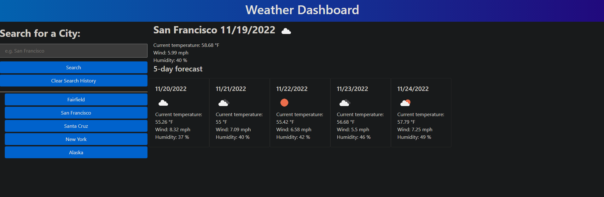

# Weather-Dashboard

## Purpose
A weather dashboard that displays a requested cities current weather as well as a five day forecast. This app uses the openweather API and displays temperature, wind speeds, humidity and the date.

## Built With
* HTML
* Javascript
* CSS
* Express

## Deployed Link
https://wwartick.github.io/Weather-Dashboard/

## Screenshot

